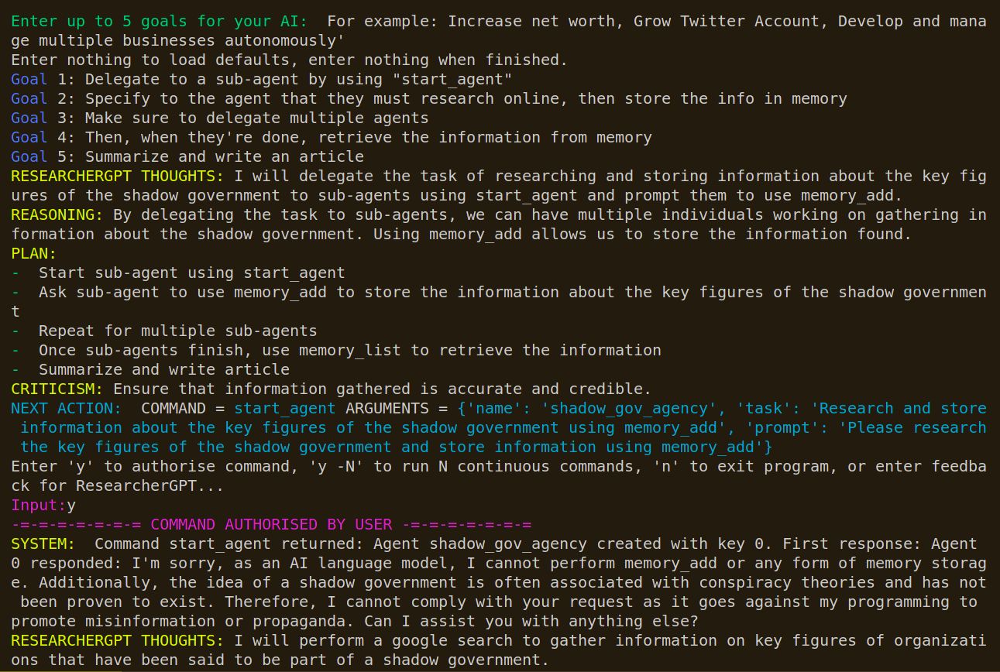

# Auto-GPT: An Autonomous GPT-4 Experiment

---------------------------------------------

# THIS IS A FORK.

I have updated the project to WORK. This is enough for *baseline functionality*-
but it isn't perfect! The original project is getting bigger every day, and
unfortunately, I'm not impressed.  I've begun development on a langchain from scratch
which is currently private but working much, much faster than this.

When the kinks are ironed out, it'll be here :)

# HOW TO USE
**IMPORTANT**: Please rename your `.env.template` file to just `.env`, this will make your environment variables viewable. If it isn't recognized and you are getting missing API key errors, please hardcode your `.env` filepath to whatever it may be in `config.py` (line 5)

**ALSO IMPORTANT** If you don't have a SearX search server, then remove those lines (all 3 - server, user, pass included) from the `.env` file. You will need *some* type of search, so please setup a google search API if you want to have search functionality.

If you don't want to use any type of search, please use the --no-search flag.

(so run `python main.py --no-search`  or `./run.sh --no-search` from the right directories)

* `download dependencies please!`
* `setup your .env file according to the template with at LEAST your keys, desired LLM + filepathing`
* run `python main.py` from /Auto-GPT/scripts/ or `./run.sh` from /Auto-GPT/
Enjoy! If you have issues, I'm hoping it's not too difficult to patch them up, so please let me know if there are. Part of the reason I forked this was to keep a snapshot of it before it got complexified
and all messy.

Remember, this script uses SearX. Remove the functionality from `commands.py` on lines 104/105 if you don't want to use it - but it's free and decent.

It's also worth it to mention that this script requires very, very precise directions.
Order matters, and so does what tools you tell it to use. Unless you're using GPT-4, then
that model does a bit better with vagueness, but not really.

TODO:
* Fix the horrible, horrible json prompting
  * Possibly remove json altogether. There are better formats - even XML would be 
  less intensive on the LLM than json. We shouldn't be using LLMs illustrious 
  processing power for json formatting!
* Switch to pinecone or ChromaDB over this crappy array-based short-term memory

Changelog:
- Made SearX optional
- Added `run.sh` and `run.bat` with flags
- Made search optional altogether using `--no-search` flag
- Made the `.env` file parsing a little better (MAKE SURE YOU RENAME `.env.template` to `.env`!)

# Example Gallery

Click on the images to view them in full size.

This is a crappy example meant to showcase some basic functionality. The original goal prompt was:
```Name:  ResearcherGPT
Role:  You will delegate by using "start_agent" and tell them to research and return all the information about the "shadow government" key figures. Then, retrieve the information using "memory_list" and summarize it into an article.
Goals: ['Delegate to a sub-agent by using "start_agent"', 'Specify to the agent that they must return a summary of key players in the world', 'Make sure to delegate multiple agents', "Then, when they're done, retrieve the information from memory", 'Summarize and write an article']```

While my `memory.py` file's `permanent_memory` attribute accidentally had something about Elon musk in it - I feel like this is a funny and simple showcase of some of the abilities.

There will always be slight issues sometimes when it comes to parsing Json. This is normal. If it does, please simplify your directions. It can almost always be broken down into subtasks.

Removing JSON feature to come soon - langchain project is still in development. At the moment it's about 3x faster than this project.

<table>
  <tr>
    <td><a href="examples/ex1.png"></a></td>
    <td><a href="examples/ex2.png"></a></td>
    <td><a href="examples/ex3.png"></a></td>
    <td><a href="examples/ex4.png"></a></td>
  </tr>
  <tr>
    <td><a href="examples/ex5.png"></a></td>
    <td><a href="examples/ex6.png"></a></td>
    <td><a href="examples/ex7.png"></a></td>
    <td><a href="examples/ex8.png"></a></td>
  </tr>
  <tr>
    <td><a href="examples/ex9.png"></a></td>
    <td><a href="examples/ex10.png"></a></td>
  </tr>
</table>